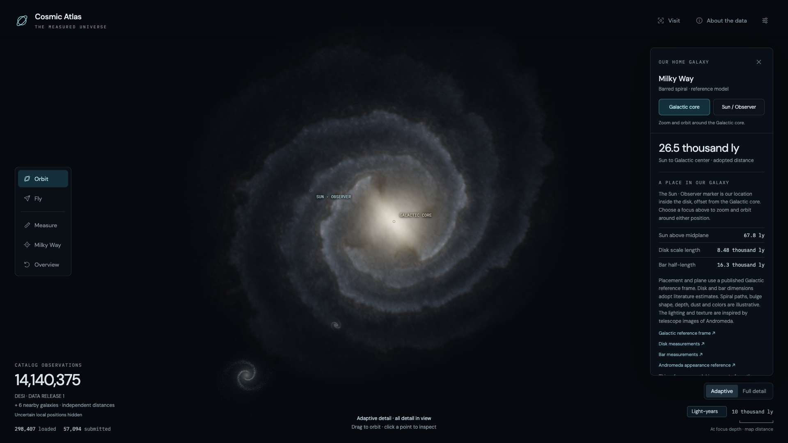
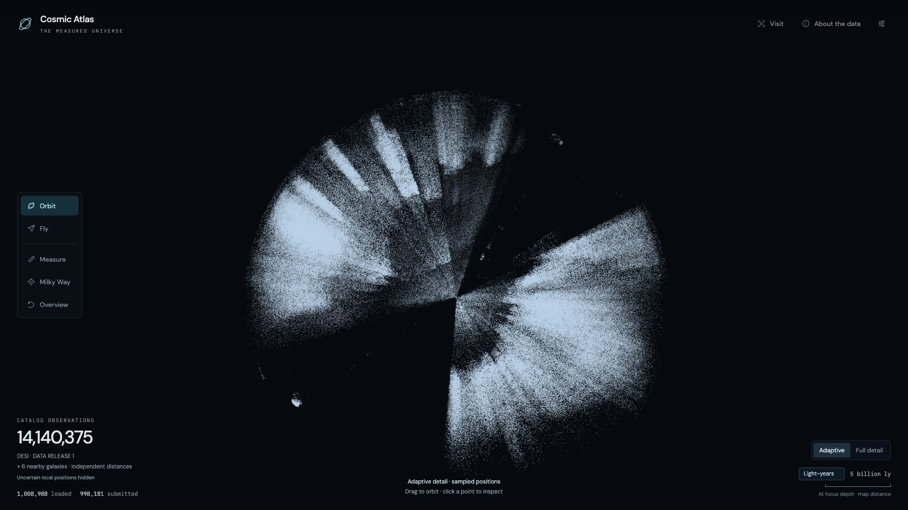
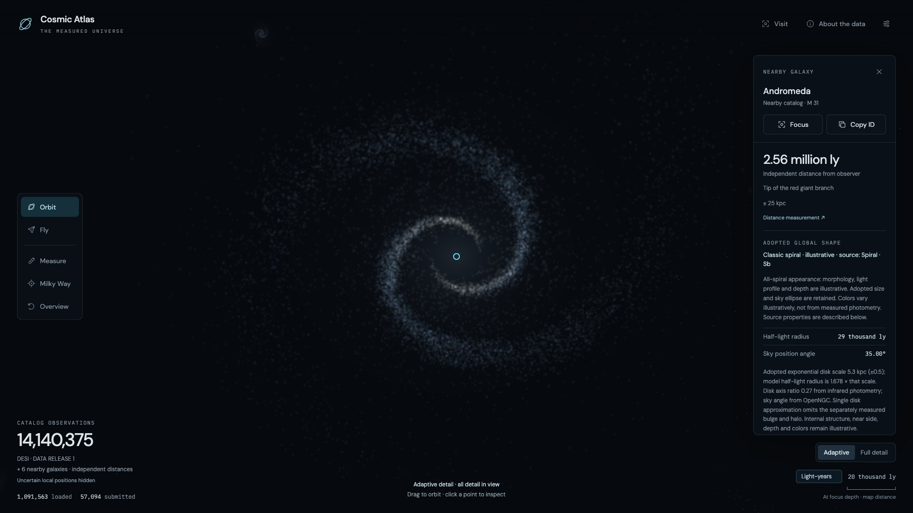

# Cosmic Atlas

A minimal 3D explorer of **14,140,375 accepted DESI DR1 galaxy observations**, plus six nearby galaxies with independently measured distances, built with TypeScript, Three.js and Vite. Browse the cosmic web, inspect catalog measurements, compare distances, fly through space, and approach galaxies to reveal procedural 3D models.

The Milky Way is a separate reference model around the Solar System. Its continuous stellar disk, soft barred center and fine dust lanes take visual cues from [Hubble images of Andromeda](https://esahubble.org/images/heic2501a/), while preserving the Milky Way’s adopted geometry. The texture, arm paths and lighting are illustrative. **Milky Way** takes you to a view centered on the Galactic core, so the galaxy stays centered as you zoom. **Sun / Observer** switches the focus to our location inside the disk.

The project is being built collaboratively by Dave and **ChatGPT Astra**, through Codex. Dave supplies the product direction, visual references and hands-on feedback; Astra implements and tests the application, data tools and documentation.



*Our home galaxy, with separate Galactic core and Sun / Observer markers. Internal structure and light are illustrative.*

<details>
<summary>More screenshots: the cosmic web and Andromeda</summary>



*A wide view of the DESI survey. Gaps reflect survey coverage and selection, not necessarily empty space.*



*Orbit around Andromeda's procedural model. Its distance and projected shape use cited measurements; spiral details and colors are illustrative.*

</details>

Screenshots are captured from the running app. [Image credits and reuse terms](docs/images/README.md).

## Built with ChatGPT Astra

Development began with requirements for a simple, scientifically grounded point map that could handle millions of galaxies. Astra helped choose the stack, research the coordinate conventions, and build the data pipeline and first working explorer. Dave tested the prototype and guided successive additions: distance fading, flight controls, name search, measured-shape galaxy models and the Milky Way reference.

The workflow is iterative: describe a feature or reproduce a problem, make a focused change, check the relevant data and automated tests, inspect actual browser rendering, and commit the result. The [requirements](docs/requirements.md), [architecture](docs/architecture.md), [validation evidence](docs/validation.md) and Git history record those decisions. Scientific assumptions are documented alongside their sources so contributors can review and improve them.

There is no runtime OpenAI dependency or API key requirement. ChatGPT Astra helps build the software; the atlas runs locally using prepared astronomy data and deterministic rendering code.

## Quick start: a small real-data preview

Clone this repository, then run these commands from its root. You need **Node.js 22.12 or newer**, npm, **Python 3.11 or newer**, and [uv](https://docs.astral.sh/uv/getting-started/installation/). A desktop browser with WebGL2 and hardware acceleration is required. The full-data tooling is intended for macOS/Linux; use WSL on Windows because the resumable downloader uses POSIX file writes.

```sh
npm ci
uv sync --frozen
npm run data:bootstrap
npm run dev
```

Open the URL Vite prints, normally **http://127.0.0.1:5173/**.

Bootstrap downloads small byte ranges from the official DESI catalog and builds a clearly labeled subset of real observations. It gives you the point map, navigation, selection, distance measurement and the Milky Way reference model. The six nearby galaxies also work in bootstrap, including their search, models and measurements. DESI-wide close-up models and additional DESI name destinations require the full-data setup below.

**Generated catalog binaries are not in Git.** A fresh clone needs bootstrap or full preparation before it can load the map. `data:bootstrap` also changes `public/data/catalog.json` to activate the sample; treat that as a local dataset choice when reviewing changes for a commit.

Once data has been prepared, subsequent sessions only need:

```sh
npm run dev
```

There is no backend account, API key or live astronomy-service dependency while browsing. Vite serves the application and locally prepared static assets; the browser does not download the original FITS catalog.

## Prepare the full atlas

Use this path for catalog-wide model development and named galaxy visits. Allow roughly **30 GB of free disk space** for the 22.37 GB source FITS file, generated datasets, dependencies and temporary files. Full preparation can take substantial time and memory; use bootstrap for ordinary UI work. Peak preparation memory has not yet been profiled.

After `npm ci` and `uv sync --frozen`:

```sh
npm run data:download
npm run data:prepare
python3 scripts/download_search_sources.py
uv run python scripts/prepare_galaxy_search.py
npm run data:models
npm run dev
```

Run the commands in order. `data:download` is resumable: rerun it after an interruption. `data:prepare` applies the documented filters, computes Planck18 comoving distances, writes the spatial hierarchy, creates a deterministic million-object development subset, and activates the full catalog. Model preparation additionally needs the name index and SGA/OpenNGC sources from the preceding commands.

The prepared full atlas contains all **14,140,375** accepted observations. Its model sidecars add about **143 MB compressed**. The name index contains **17,320 names** and **3,181 verified catalog destinations**; an unmatched familiar name does not receive a fabricated position.

Search distinguishes names it recognizes from places it can visit. Andromeda now resolves to the independently measured nearby layer. Names without either a nearby entry or a matched DESI destination (for example, the Sombrero Galaxy) retain a location-unavailable explanation. Only available galaxies are selectable; **Browse available galaxies** returns to usable suggestions.

To work with the million-object subset after full preparation, open `/?dataset=development`. Full catalog model/name matching is deliberately disabled for subsets. The Milky Way and six nearby galaxies are available independently.

The two original individually fitted previews and the Milky Way reference data are checked in. To regenerate them:

```sh
# Requires the full source catalog and prepared DR1 metadata:
uv run python scripts/prepare_galaxy_detail.py

# Small, independent reference calculation; no DESI download needed:
uv run python scripts/prepare_milky_way.py
```

## How it works

Python, NumPy, Astropy and SciPy prepare immutable binary datasets ahead of time. The browser streams a spatial hierarchy, initially drawing a representative set of real catalog positions and revealing more as you approach. **Full detail** loads all accepted observations in view once loading completes. The disclosed local-distance display safeguard applies in both detail modes.

The main renderer batches point geometry, uses camera-relative coordinates to retain precision at galaxy scales, and performs selection on the GPU. A Web Worker decompresses and validates chunks. The browser never creates a scene object or DOM element for every galaxy and never integrates cosmological distances during navigation.

Nearby catalog objects outside the local-distance safeguard crossfade into bounded analytic light volumes and, where appropriate, seeded spiral arms or irregular clumps. There are at most **12 resident DESI models**, plus six fixed nearby models and the Milky Way reference. The nearby layer batches its six distant points into one draw call; its geometry is bounded to about 3.8 MiB in the default spiral appearance (2.6 MiB with catalog types). Models start resolving about 1.6 times farther away than before. Streamed models retain their identity across point-chunk changes and fade in/out over 0.6 seconds; a ranking margin limits repeated replacements within the fixed pool. Automatic display fades incidental models back to points before they fill the view. **Visit** or **Focus** keeps the chosen galaxy visible for deliberate close-ups. Settings also offers **Focused galaxy only** and **Points only**.

**All spirals** is the default appearance for now. Every catalog/nearby model uses one of three related disk illustrations: classic spiral, fine multi-arm spiral, or ringed spiral disk. They share the original spiral’s light profile, exposure, radial particle distribution and particle count, preserving the adopted center, radius and projected sky ellipse. Variants are assigned stably by galaxy identity, with the classic spiral most common; these are visual recipes, not new catalog classifications. Settings → **Galaxy appearance → Catalog types** restores the source-based variants. The override changes the light profile and assumed depth; it does not reclassify galaxies or change their source data. Galaxy models also receive subtle, stable blue-white to ivory palettes with warmer centers and faint pink accents. These are illustrative colors, not measured photometry; they remain the same when models reload or appearance changes.

The visual direction is a dark, uncluttered atlas with recognizable galaxy shapes, restrained glow and varied orientations. Dense fly-through views with many small galaxy silhouettes are a future intermediate level of detail; currently distant observations remain points.

## Where to make changes

| File or directory | Responsibility |
| --- | --- |
| [`src/app.ts`](src/app.ts) | HUD markup, inspector panels, settings, control wiring and optional WebMCP actions |
| [`src/style.css`](src/style.css) | Layout, theme, responsive controls and scrolling panels |
| [`src/explorer.ts`](src/explorer.ts) | Camera/navigation, point shaders, streaming decisions, GPU picking, model pool and diagnostic probes |
| [`src/galaxy-variants.ts`](src/galaxy-variants.ts) | Stable disk variant recipes and identity-based assignment |
| [`src/galaxy-colors.ts`](src/galaxy-colors.ts) | Stable per-galaxy color palettes, restrained tint range and brightness normalization |
| [`src/galaxy-detail.ts`](src/galaxy-detail.ts) | Shared volume renderer, measured-shape projection, model fading and seeded light geometry |
| [`src/model-catalog.ts`](src/model-catalog.ts) | Profile sidecar loading, decoding and morphology interpretation |
| [`src/nearby-galaxies.ts`](src/nearby-galaxies.ts), [`src/data/nearby-sources.json`](src/data/nearby-sources.json) | Nearby entries, independent distance provenance, model inputs and separate identities |
| [`src/local-distances.ts`](src/local-distances.ts) | Conservative display guard for uncertain local redshift positions |
| [`src/milky-way.ts`](src/milky-way.ts), [`src/milky-way-light.ts`](src/milky-way-light.ts) | Home-galaxy placement, procedural density field, dust/starlight volume and arrival direction |
| [`src/galaxy-search.ts`](src/galaxy-search.ts) | Name normalization, suggestions and cancellable visits |
| [`src/loader.ts`](src/loader.ts), [`src/data.worker.ts`](src/data.worker.ts) | Chunk requests, decompression, integrity checks and data lifetimes |
| [`src/spatial.ts`](src/spatial.ts), [`src/format.ts`](src/format.ts) | Hierarchy selection, coordinate conversion, distances and display units |
| [`scripts/`](scripts) | Reproducible data downloads, preparation and independent validation |
| [`tests/`](tests) | Geometry, parsing, catalog and rendering-policy tests |
| [`src/diagnostics.ts`](src/diagnostics.ts), [`src/ui-diagnostics.ts`](src/ui-diagnostics.ts) | Development-only browser acceptance runners |

For a UI change, start with `app.ts` and `style.css`; Vite updates the page as you edit. For a camera or navigation change, start with `explorer.ts`. For galaxy appearance, use `galaxy-detail.ts`, `galaxy-variants.ts` or `milky-way-light.ts`; the common illustrative disk profile is regenerated by `uv run python scripts/prepare_spiral_profile.py`; keep display effects distinct from measured physical properties.

For Milky Way placement or adopted dimensions, edit `scripts/prepare_milky_way.py`, regenerate the small JSON reference, and update its sources/assumptions. For catalog formats, change the producer, consumer and validators together. Do not hand-edit generated binary chunks or their checksums.

Read [`AGENTS.md`](AGENTS.md) before contributing. Make small, coherent commits, preserve existing user work, and include the relevant tests and documentation. Raw source downloads, generated `.bin`/`.bin.gz` files, caches, dependencies and build output stay out of Git.

To modify the nearby layer, edit the pinned measurements and source links in `src/data/nearby-sources.json`, then run:

```sh
uv run python scripts/prepare_nearby_galaxies.py
npm test
```

The generator reads that small source excerpt, converts coordinates/distance moduli and projected ellipses, and fits illustrative smooth light profiles. It needs no full DESI download or network request. Keep IDs negative and stable, aliases unambiguous, and adopted measurements distinct from missing-shape assumptions. The renderer currently supports a maximum of 12 nearby entries; use a bounded streaming design before expanding beyond that. Details are in [nearby-galaxies.md](docs/nearby-galaxies.md).

## Controls

| Action | Control |
| --- | --- |
| Orbit / pan / zoom | Drag / right-drag / scroll or pinch |
| Inspect a catalog galaxy | Click its point or visible body |
| Focus selection / survey overview | **F** / **R** |
| Visit by name | **Visit**, type a name, arrows to choose, **Enter** |
| Explore our galaxy | **Milky Way** in the toolbar, or search its name |
| Compare two catalog distances | **Measure**, then click two galaxies |
| Configure flight | **Fly**, adjust speed, then **Start flying** |
| Manual flight | **WASD**, **Q/E**, **Shift** to accelerate; scroll changes speed |
| Release the pointer | **Escape**; the speed controls remain available |
| Slow camera pass with the mouse free | **Auto fly**; **Escape** pauses it |
| Galaxy appearance, rendering mode, local uncertainty, point enlargement and distant opacity | **Settings**; these choices persist locally |
| Performance readout | **F8** |

**Enlarge nearby points** is off by default. Enable it in Settings to restore the optional marker-size boost; distance fading works independently. The toggle affects point markers, while galaxy models keep their physical dimensions.

**Show uncertain local positions** is off by default. Redshift-only positions within 1 Mpc of the observer can land inside the Milky Way because very small redshifts do not establish reliable nearby distances. Enable the setting to inspect these original records as amber points, with no physical models. The full catalog count is preserved. This is a display safeguard, not corrected distance data or a reliability boundary. [Audit and scientific context](docs/local-distance-audit.md).

Flight speed ranges from 1 parsec/sec to 10,000 megaparsecs/sec. Start low for galaxy-scale passes. The observer marker identifies the Solar System, about 26,500 light-years from the adopted Galactic center, rather than the center itself.

## Test and build

The fast tests do not require the full FITS source:

```sh
npm test
npm run test:data
```

Validate whichever point dataset you prepared:

```sh
uv run python scripts/test_data.py public/data/bootstrap
# Or, after full preparation:
uv run python scripts/test_data.py public/data/dr1
npm run test:models
```

The Python validators check compressed hashes, binary layouts, reconstructed coordinates, bounds and full leaf coverage. `test:models` requires the complete generated model sidecars.

For production output:

```sh
npm run build
npm run preview
```

`build` checks active dataset asset presence/sizes, runs strict TypeScript compilation and writes the static application to `dist/`. Preview the URL printed by Vite. A missing-data build error is intentional: prepare the active dataset first, and run the model preparation step for full DR1.

### Actual-browser checks

Run these against `npm run dev`, using a unique `run` name:

| URL query | Checks |
| --- | --- |
| `?selftest&run=my-points` | Point visibility/picking, measurement persistence, data integrity rejection and graphics recovery |
| `?hometest&run=my-milky-way` | Core-centered toolbar/search/wheel navigation, separate Sun focus, labels, body picking, inside/near-Sun rendering, display modes, marker clipping and graphics recovery; full data also checks the embedded-position safeguard and raw-position setting |
| `?uxtest&run=my-navigation` | Foreground obstruction, focus intent, reachable actions, delayed-search cancellation and flight controls; requires full data |
| `?varianttest&variantpreview&run=my-variants` | Side-by-side GPU disk previews plus brightness/highlight, rendering budget, body picking and recovery checks at three inclinations |
| `?colortest&run=my-colors` | GPU color variation with identical geometry, stable brightness, deterministic reconstruction, draw/geometry budgets and graphics recovery |
| `?continuitytest&run=my-spirals` | Saved appearance switch, preserved source properties, and two Andromeda orbits checking model continuity and the 12-model bound; orbit check requires full data |
| `?nearbytest&run=my-neighbors` | All six search destinations, center framing, model/point picking, projected shapes, independent-distance measurements and graphics recovery; works with subsets |
| `?modeltest&run=my-models` | All five catalog families, projected shape, body selection, automatic loading and the model pool limit; requires full data |
| `?benchmark=adaptive&run=my-overview` | 1920×1080 overview orbit: 5-second warmup, 20-second measurement |
| `?benchmark=full&run=my-full-overview` | The same benchmark with full detail in view |

Use Automatic model display for the full model suite. Keep the browser tab visible during the run. Reports appear on screen and save to `.cache/validation-<run>.json`; check the individual `passed`/result fields, not just `status: complete`. These routes and the report-saving endpoint are development-only. Return to `/` before editing to avoid rerunning a diagnostic on every hot reload.

Measured results and device-specific limitations are in [`docs/validation.md`](docs/validation.md). Performance on one GPU is not a guarantee for other hardware.

## Why familiar nearby galaxies can be missing

The initial atlas imports a filtered **DESI DR1 redshift survey**, not a combined census of all known galaxies. A recognized name without a visit location means our application has not integrated a usable 3D record for it; it does not mean astronomers have failed to catalog the galaxy.

The DESI importer accepts positive redshifts and converts them to Planck18 distances. This works poorly in our immediate neighborhood, where galaxies' own motions matter: Andromeda (M31), for example, is approaching us and has a blueshift. Its measured distance must come from another method. Very small positive redshifts can also produce implausible positions inside the Milky Way, which is why the app hides uncertain redshift-only positions below 1 Mpc by default.

The app now adds **Andromeda (M31), Triangulum (M33), the Large and Small Magellanic Clouds, M32 and M110** using published redshift-independent distances. Search their common names or aliases to visit them. Their six entries are counted separately and bypass the redshift-only display guard. Original DESI observations remain intact; the combined view is not a globally deduplicated census.

Adopted distances and errors are linked in each inspector. M31/M33 use literature disk scales, M32/M110 use catalog half-light radii, and the Clouds have explicitly illustrative size/structure assumptions. Projected angles/axis ratios follow cited measurements where available; the LMC model does not claim a measured orientation. Depth, near side, arms, clumps and colors remain illustrative. Nearby distances are placed directly on the observer-centered Mpc axes, without using recession velocity as a distance or applying a cosmological correction. Mixed local/DESI measurements are labeled as map separations. [Full provenance and limitations](docs/nearby-galaxies.md).

References: [NASA on Andromeda](https://science.nasa.gov/mission/hubble/science/explore-the-night-sky/hubble-messier-catalog/messier-31/), [NASA/IPAC on local distance limitations](https://ned.ipac.caltech.edu/Documents/Overview), and the [confirmed local-position audit](docs/local-distance-audit.md).

## Scientific boundaries and data credit

This is an observer-centered reconstruction of catalog measurements, not a complete census or a simultaneous snapshot of the universe. DESI distances are **linear comoving distances inferred with Planck18**; redshift includes local velocity effects. The six nearby entries instead use independently measured local distances. Survey gaps are not proof of empty space. Point size, opacity and color are navigation cues, not measured luminosity.

Of the catalog profile records, **12,097,577 (85.6%)** have usable measured sizes and projected ellipses. Models for the remainder disclose an assumed 5 kpc half-light radius. Records inside the local-distance safeguard are excluded from model rendering regardless of their profile. **3,128** have matched visual classifications; other families are labeled approximations in Catalog types mode. The default All spirals mode deliberately overrides their rendered morphology and light profile, with an explicit inspector disclosure. Inferred depth, near side, spiral structure, clumps and colors remain illustrative. The Milky Way uses separately documented literature-based geometry and is excluded from DESI counts and pair measurements.

See [galaxy model provenance](docs/galaxy-detail.md), [Milky Way assumptions and sources](docs/milky-way.md), and [data credits and processing notes](public/acknowledgments.txt).

## License

Original application code, tooling and documentation are available under the [MIT License](LICENSE). You can use, modify and redistribute them, including commercially, while retaining the license notice.

Astronomy data and third-party assets keep their own terms: DESI data are **CC BY 4.0**; OpenNGC-derived name indexes, model sidecars and the combined nearby reference are **CC BY-SA 4.0**. MIT does not relicense those datasets, dependencies or fonts. Preserve [data attribution and processing notes](public/acknowledgments.txt), [third-party notices](public/third-party-notices.txt) and the [CC BY-SA license](public/licenses/CC-BY-SA-4.0.txt).

The README screenshots use [separate CC BY-SA 4.0 image terms and source credits](docs/images/README.md).

## Public hosting and project documents

The intended release is a public URL with the source shared on GitHub. The current full catalog fits Cloudflare Pages' documented per-file and file-count limits for Wrangler Direct Upload, so separate object storage is optional. See [public delivery](docs/public-delivery.md) for release builds, private deployment settings, costs and the publication checklist.

Hosting account details, tokens, project configuration and build output stay local in ignored files. Only generic instructions and sanitized templates belong in Git. The public application and its data URLs are necessarily visible to visitors; `.gitignore` protects repository contents, not deployed browser assets or old Git commits. Local development requires no hosting account.

- [Requirements](docs/requirements.md) and [build plan](docs/build-plan.md)
- [Architecture and coordinate conventions](docs/architecture.md)
- [Model provenance](docs/galaxy-detail.md) and [Milky Way reference](docs/milky-way.md)
- [Validation evidence](docs/validation.md) and [UI review](docs/ux-review.md)
