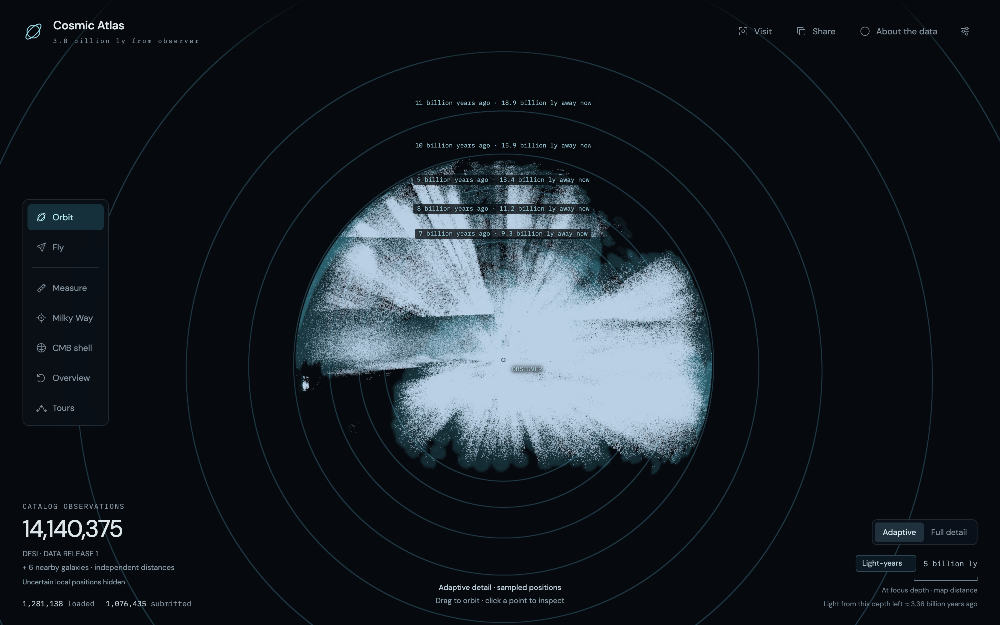
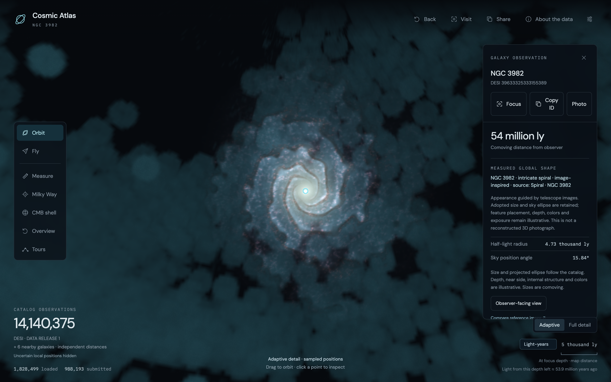
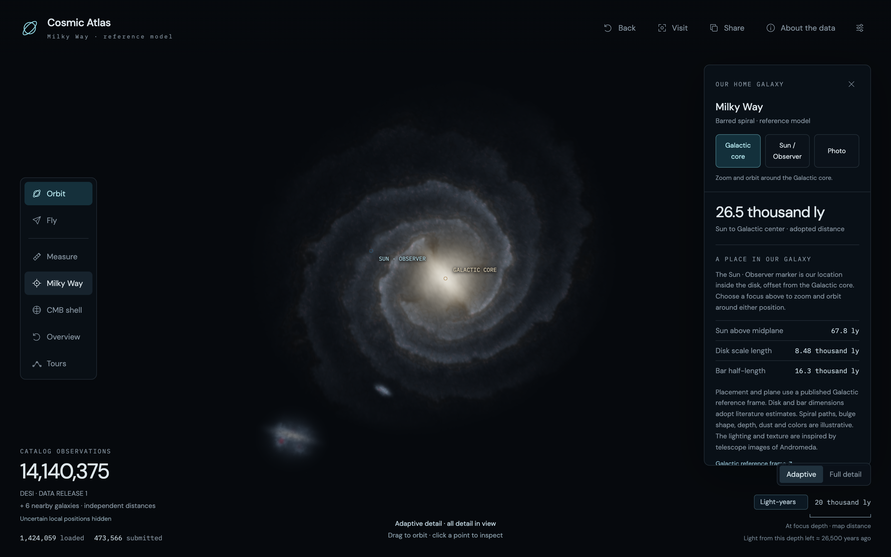
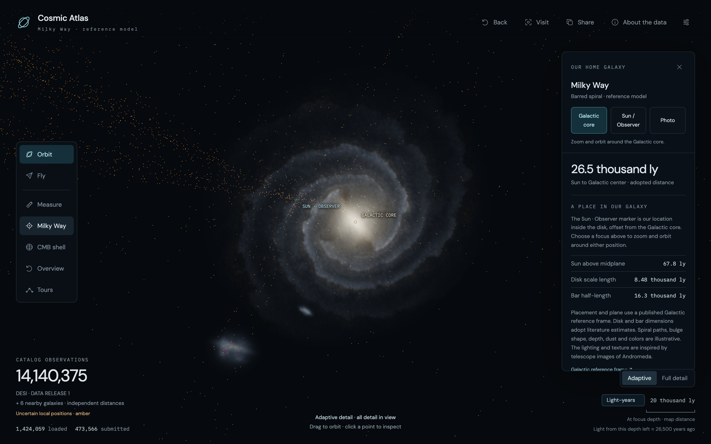

# Cosmic Atlas — a 3D map of 14,140,375 measured galaxies, for anyone who wants to see where things actually are

**What it is:** A browser app that draws every accepted galaxy observation in the DESI Data Release 1 redshift catalog as a point in three-dimensional space, with the Solar System at the origin. You orbit, fly, and zoom from the Sun out to the cosmic microwave background; click any point for its exact DESI target ID, sky position, redshift and derived distance; measure the separation between two galaxies; search for named galaxies; and fly up close, where a point resolves into a procedural 3D model whose size and projected shape come from the catalog. Ten nearby galaxies with independently measured distances, a Milky Way reference model, lookback-time rings, the survey footprint and a ten-stop guided road trip sit alongside the survey. Everything the app shows is labelled as measured, adopted or illustrative, and the app never pretends a gap in the survey is empty space.

**Stack:** Strict TypeScript with Three.js on WebGL2, built by Vite; Python 3.11 with NumPy, Astropy and SciPy for the offline data pipeline; Playwright for real-GPU browser checks. 47 TypeScript files totalling 417 KB of source (written densely: 4,619 physical lines); 17 Python scripts, 1,295 lines; 14 Node scripts, 891 lines; 25 unit-test files with 124 tests; 19 documents, 1,914 lines. Runtime dependencies: <code>three</code> and two font packages. No backend, no API keys, no runtime calls to any astronomy service.

---

## The architecture

<pre><code>
  OFFLINE  (Python 3.11 - NumPy - Astropy - SciPy)             BROWSER  (strict TypeScript - Three.js - WebGL2)
  zall-pix-iron.fits  22,371,272,640 bytes, 28,425,963 rows     +--------------------------------------------------+
    |  six filters       ->  14,140,375 accepted, unique IDs     |  app.ts       HUD, dialogs, settings, share, tours |
    |  Planck18 distance ->  65,537-point lookup, 1.8e-7 Mpc err |  explorer.ts  camera, LOD frontier, batched points,|
    |  SplitMix64(targetID) ->  deterministic per-node samples   |               GPU ID picking, 12-model pool,       |
    v                                                            |               overlays, camera travel              |
  octree: 1,010 nodes, 882 leaves                                |  data.worker  fetch, sha256, gunzip, transfer      |
    node.points.bin  f32 xyz + u32 id   -- gzip -->  984 MB      |  model worker profile sidecars, LRU 48 MiB         |
    node.meta.bin    56-byte f64 rows   -- gzip -->  (all nodes) |  vertex path  float32 chunk positions relative to  |
    node profiles    20-byte rows       -- gzip -->  143 MB      |               a float64 node center; camera        |
  sidecars: 17,320 names, 720x360 footprint, lookback table,     |               subtraction on the CPU each frame    |
    ten nearby galaxies, Milky Way frame, tours, photographs     +--------------------------------------------------+
                                                                 Cloudflare Pages: 3,070 static files, 1,081.9 MiB
</code></pre>

The line down the middle is the whole design. Python does everything that is slow, numerical or needs the 22 GB source file: it filters 28.4 million rows down to 14,140,375 primary galaxy targets, converts each redshift to a Planck18 comoving distance through a validated lookup table (maximum error 1.77 × 10⁻⁷ Mpc against Astropy), and writes an octree of immutable, checksummed binary chunks. The browser downloads only those chunks. It never sees a FITS file and never integrates a cosmological distance; even the lookback-time table it interpolates was generated offline.

The octree is the contract that lets a laptop browse 14 million points. Every node carries a deterministic sample of its descendants, chosen by hashing real target IDs, so a coarse view is a stable subset of real objects rather than a synthetic average. A render frontier holds either a parent sample or all of its covered children, never both, so nothing is drawn twice and nothing is missed. Leaves hold every point assigned to them, which is what makes the explicit Full detail mode honest: it submits all 14,140,375 observations, and the footer says so.

Two precisions live side by side. Chunk positions are float32 relative to a float64 node center, and the CPU subtracts the camera position from that center each frame before anything reaches the shader. That one subtraction is why the same scene can orbit ten parsecs from the Sun and 4,830 Mpc from it without jitter, while inspection and measurement reconstruct float64 positions from the original RA, Dec and distance rather than trusting render coordinates.

<figure class="writeup__figure">
  
  <figcaption>Reference overlays cost one full-screen triangle each. The lookback rings are drawn in angle space from the observer, so they survive float32 cancellation near the Sun; the ages come from a 256-row Planck18 table generated offline, and the browser only interpolates.</figcaption>
</figure>

## Three decisions that carry the app

### 1. No object per galaxy, ever

**A scene graph with 14 million children is not a design; it is a crash.** Galaxy records never become individual scene objects or DOM elements. Points live in batched per-chunk geometries; the abortable worker fetches, verifies the SHA-256, decodes gzip and hands over transferable typed arrays; a bounded queue prioritises coarse coverage before visible refinement; resident chunks track last use and eviction disposes GPU buffers. Memory accounting covers point arrays, GPU attributes, metadata and in-flight reservations, and Full detail stops with an explicit memory-limit state instead of silently sampling. Distance fading, the optional nearby-point enlargement and the local-distance guard all run inside the one existing vertex shader with shared uniforms: no extra attributes, no extra draw calls. Even the GPU-side model crossfade indexes a small uniform array through a per-point slot attribute, so switching which twelve galaxies are resolved touches only the matching rows.

### 2. The 64-bit DESI target ID is the only identity that counts

**Every path to a galaxy re-derives the exact target ID from checksummed data before it is allowed to select anything.** IDs exceed 2⁵³, so they are read with BigInt and shown as strings. Picking renders the same point geometry a second time with unblended integer-colour IDs and reads back asynchronously; the dense ID maps to a node row, and the row's metadata is decoded from the verified chunk. Name search joins 17,320 SGA and OpenNGC names to DESI rows only through an exact reference-catalog match within 3 arcsec, which yields 3,181 verified destinations; the other names remain searchable but are shown in a separate panel that explains why they cannot be visited, rather than inventing a position. Share links carry <code>desi:node:row:targetId</code> and a strict decoder that never throws; on arrival the row is re-read and the ID must match, or the camera moves alone with the notice that the catalog does not contain that galaxy. The dense internal index is never carried in a link.

<figure class="writeup__figure">
  
  <figcaption>NGC 3982 reached by name. The inspector shows the exact DESI target ID, the comoving distance, the measured half-light radius and position angle, and states that depth, structure and colours are illustrative.</figcaption>
</figure>

### 3. Close-up models are a bounded pool with the honesty written on them

**At most twelve DESI galaxies are resolved at once, and each one says what is measured.** A separate 143 MB set of profile sidecars aligns one 20-byte row with every point row: half-light radius, ellipticity, Sérsic index, the imaging fit type and, for 3,128 galaxies, a matched visual type. 12,097,577 observations have a usable measured shape; the 2,042,798 that do not use a disclosed 5 kpc fallback with unknown orientation, and the inspector says so. During movement the renderer scans packed positions only in nearby resident chunks, at most every 250 ms, and ranks projected radii; a model's Gaussian light profile is integrated analytically along each camera ray in a single draw call, with one batched geometry of 12,000 light knots for spiral structure. Replacements fade over 0.6 s before releasing their slot, and a galaxy you deliberately visited is protected from eviction. The default all-spirals appearance is a user choice that the inspector discloses next to the source classification; radius, projected ellipse and identity never change with appearance.

## The bug that shaped the design: 1,107 galaxies inside the Milky Way

Dave noticed sharp catalog points sitting inside the Milky Way model, apparently between the Sun and the Galactic core. Three things could have explained it: background points projected through the disk, the illustrative light of the model itself, or the optional marker enlargement. None of them did.

The audit read the one leaf of 882 whose bounds intersect a sphere eight Milky Way radii across, verified its checksum, and reconstructed float64 positions from the stored RA, Dec and distance. 1,107 accepted observations lie inside the model's 34.91 kpc bounding sphere; 186 inside the flattened disk envelope; 80 inside the ellipsoid used for body picking. Their catalog redshifts run from 1.44 × 10⁻⁹ to 9.25 × 10⁻⁶. Every one of them passes the quality filters: a primary record, classified GALAXY, warning flags clear, finite positive redshift. The importer had done exactly what it was told and turned each redshift into a Planck18 comoving distance, and the nearest of them landed 4 kpc from the Galactic core.

The cause is not a bug in the code but in the premise. Redshift is a usable distance proxy across the survey and a useless one inside the Local Group, where peculiar velocities are the same size as the Hubble flow. The catalog flags say a spectrum looks like a galaxy; they say nothing about whether the redshift means distance.

<figure class="writeup__figure">
  
  
  <figcaption>Default view, then the same view with Show uncertain local positions on. The amber points are real DESI rows whose redshift-only distance falls below 1 Mpc. They are never deleted, never moved and never given a physical model.</figcaption>
</figure>

Two fixes were rejected. Deleting the rows would change the catalog count and hide a real limitation of the data. Correcting the distances is impossible without independent measurements. What shipped is a display safeguard: redshift-only positions whose inferred distance is below 1 Mpc are hidden by default, and a saved Settings toggle reveals them in amber with explicit uncertainty warnings and no models. The guard is a few lines in the existing point vertex shader, reconstructing observer distance from the chunk-relative attribute and a per-chunk origin uniform, activated only for chunks whose bounds intersect the radius. It is applied after opacity, so neither disabling fading nor a 100% opacity floor can leak a hidden point, and the GPU ID pass shares the same decision so a hidden point cannot be picked either. The regression replays all 1,107 positions from four orbit angles on the real GPU: they covered 8,723 to 10,934 pixels before the fix and zero afterward.

The limitation then drove a feature. Because the survey genuinely cannot place the Local Group, the six familiar nearby galaxies were added as a separate layer with independently measured distances (Andromeda 785 ± 25 kpc from the tip of the red giant branch, the Magellanic Clouds from eclipsing binaries), namespaced identities, null redshift fields and their own count in the HUD. They bypass the guard because their provenance is different, and the audited DESI rows are still neither corrected nor repositioned.

## Results

| | |
| --- | --- |
| Source catalog | DESI DR1 <code>zall-pix-iron.fits</code>, 22,371,272,640 bytes, 28,425,963 rows |
| Accepted observations | 14,140,375 unique primary galaxy targets, all served |
| Catalog package | 1,010 octree nodes, 984,457,330 compressed bytes; 143 MB of profile sidecars |
| Distance accuracy | 1.772 × 10⁻⁷ Mpc maximum lookup error versus Astropy; 0.00024 Mpc per axis float32 rounding in the coarsest nodes |
| Steady orbit, Apple M3 Max, 1920 × 1080 | Adaptive: 120 FPS, p95 10.3 ms, 1,990,709 points submitted. Full detail: 20.8 FPS, p95 59.5 ms, all 14,140,375 submitted |
| Ten-stop road trip plus 600 s exploration, Chrome 153 | First navigable view 755 ms; movement frame p95 / p99 16.8 / 33.3 ms; 4 of 20,361 intervals over 50 ms; peak managed memory 486 MiB |
| Same route at emulated 5 Mbps | First navigable view 3,846 ms; the route completes |
| Automated checks | 124 unit tests; 14 real-GPU diagnostic suites; 1,020 Playwright assertions across Chrome 153 and WebKit 26.6; Python validators over every chunk checksum and sidecar |
| Delivery | Cloudflare Pages, 3,070 files, 1,081.9 MiB, largest file 3.24 MiB, no backend |
| Build | 132 commits from 10 to 14 September 2026; public URL verified live 11 September 2026 |

## Engineering choices worth defending

- **The full catalog ships, or nothing does.** The first hosting attempt rejected the 1,063,492,539-byte package against a 536,870,912-byte limit. The answer was a different host with content-fingerprinted release paths and an explicit asset allowlist, not a smaller sample. The requirements say never reduce coverage to fit, and the build fails if a byte count or hash drifts.
- **Three words for every number: measured, adopted, illustrative.** The inspector, tour captions and Milky Way panel each say which is which, and a unit test pins every number a tour caption quotes to the data file it came from, so a caption cannot silently outlive its source.
- **Adaptive by default, Full detail on request, and the footer never lies.** A sampled view says sampled positions; a complete one says all detail in view; a memory-limited one says so rather than quietly degrading.
- **Keep the faint background.** The 0.5% opacity floor keeps distant points pickable. An experiment at zero floor cut render-callback CPU from 7.3 ms to 2.3 ms but produced no frame-time gain, so the coverage stayed and the experiment is recorded, not shipped.
- **Every GPU feature has a replayable check on the actual GPU.** Fourteen query-flag suites drive the real controls, orbit, read pixels back, force WebGL context loss and verify recovery. The benchmark harness injects its instrumentation from Playwright so no measurement code ships in the bundle.
- **Links and files are trust boundaries.** View links, tour invitations and custom trips have strict grammars with bounded lengths, are decoded without throwing, and re-verify identities against the catalog before anything is selected.
- **Two AI engineers, one rulebook.** ChatGPT Codex and Claude Code both implement against the same AGENTS.md, each feature runs as one developer plus two reviewers, and commits are small and frequent. The process rule that mattered most was procedural: a Vite reload from someone else's commit corrupts a GPU run, so every run records the checkout before and after.
- **Written-down limits.** Physical-phone performance is untested; Safari and Firefox were validated on the one-million-row development subset, not the full catalog; and every redshift-derived position carries peculiar-velocity error that no display policy removes.

## What I'd build next

An intermediate silhouette level between points and full models, so a fly-through shows many small recognisable galaxy shapes inside a bounded draw budget; today there are points, then twelve resolved galaxies, and nothing in between. The catalog package will eventually outgrow Pages and needs an object-storage path that keeps the same fingerprinted contract. And the phone layout has been exercised only through simulated touch on a Mac GPU; a physical device will find things a simulator cannot.
